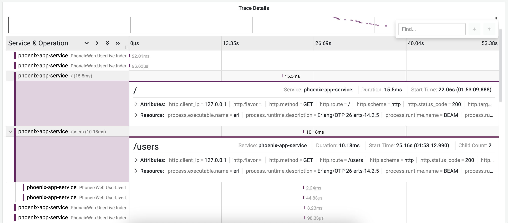

# Instrumenting Phoenix application with OpenTelemetry

1. Open this directory in your terminal.

2. Install the project dependencies using the following command:

```bash
mix deps.get
```

3. Run the docker-compose file to start the Postgres database:

```bash
docker-compose up -d --build
```

4. Obtain the OTLP Auth Header from the [Last9 dashboard](https://app.last9.io).
   The Auth header is required in the next steps.

5. Next, run the commands below to set the environment variables.

```bash
export OTEL_SERVICE_NAME=phoenix-app-service
export OTEL_EXPORTER_OTLP_ENDPOINT=https://otlp.last9.io
export OTEL_EXPORTER_OTLP_AUTH_HEADER="Basic <BASIC_AUTH_HEADER>"
```

6. Run the Phoenix application:

```bash
mix phx.server
```

7. Once the server is running, you can access the application at
   `http://localhost:4000` by default. You can go to the `/users` route to start
   interacting with the application.

8. Go to the [Last9 dashboard](https://app.last9.io) to view the traces.


