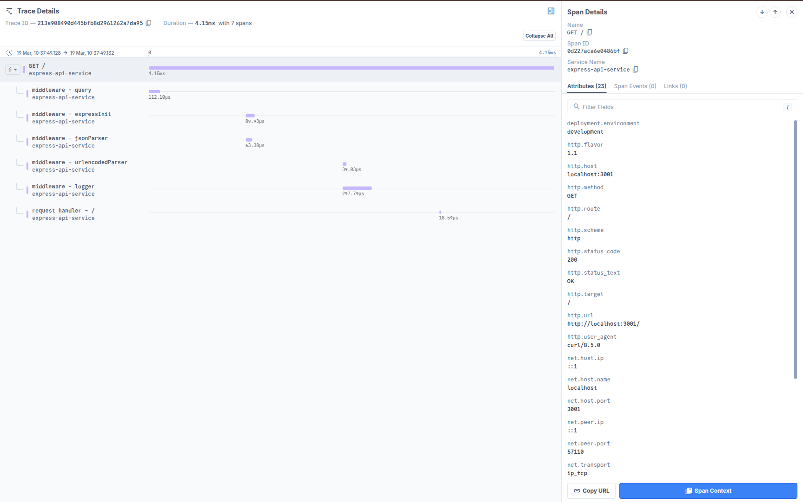

# Auto instrumenting Express application with OpenTelemetry

This example demonstrates how to auto-instrument an Express application with
OpenTelemetry. This example is tested with **Node.js v18**, **Node.js v20**, **Node.jsv22**.

**OpenTelemetry package versions used in this example:**

- @opentelemetry/api: 1.9.0
- @opentelemetry/auto-instrumentations-node: 0.59.0
- @opentelemetry/exporter-trace-otlp-grpc: 0.201.1
- @opentelemetry/exporter-trace-otlp-http: 0.201.1
- @opentelemetry/instrumentation: 0.201.1
- @opentelemetry/resources: 2.0.1
- @opentelemetry/sdk-node: 0.201.1
- @opentelemetry/sdk-trace-base: 2.0.1
- @opentelemetry/sdk-trace-node: 2.0.1
- @opentelemetry/semantic-conventions: 1.34.0
- @opentelemetry/instrumentation-runtime-node: 0.16.0
- @opentelemetry/sdk-metrics: 2.0.1
- @opentelemetry/exporter-metrics-otlp-http: 0.201.1
- @opentelemetry/exporter-metrics-otlp-grpc: 0.201.1 (optional)

**Resource detector packages (optional):**
- @opentelemetry/resource-detector-container: 0.7.2
- @opentelemetry/resource-detector-aws: 2.2.0
- @opentelemetry/resource-detector-gcp: 0.36.0
- @opentelemetry/resource-detector-azure: 0.9.0

**To install these exact OpenTelemetry dependencies:**

```bash
npm install \
  @opentelemetry/api@1.9.0 \
  @opentelemetry/auto-instrumentations-node@0.59.0 \
  @opentelemetry/exporter-trace-otlp-grpc@0.201.1 \
  @opentelemetry/exporter-trace-otlp-http@0.201.1 \
  @opentelemetry/instrumentation@0.201.1 \
  @opentelemetry/resources@2.0.1 \
  @opentelemetry/sdk-node@0.201.1 \
  @opentelemetry/sdk-trace-base@2.0.1 \
  @opentelemetry/sdk-trace-node@2.0.1 \
  @opentelemetry/semantic-conventions@1.34.0 \
  @opentelemetry/instrumentation-runtime-node@0.16.0 \
  @opentelemetry/sdk-metrics@2.0.1 \
  @opentelemetry/exporter-metrics-otlp-http@0.201.1
# Optional, for OTLP metrics over gRPC:
# npm install @opentelemetry/exporter-metrics-otlp-grpc@0.201.1
```

1. To clone this example run the following command:

```bash
npx degit last9/opentelemetry-examples/javascript/express/js express
```

2. In the `express/env` directory create `.env` file and add the contents of
   `.env.example` file.

   ```bash
   cd env
   cp .env.example .env
   ```

3. Obtain the OTLP endpoint and the Auth Header from the Last9 dashboard and
   modify the values of the `OTLP_ENDPOINT` and `OTLP_AUTH_HEADER` variables
   accordingly in the `.env` file.

4. Next, install the dependencies by running the following command in the
   `express` directory:

```bash
npm install
```

5. To build the project, run the following command in the `express` directory:

```bash
npm run build
```

6. Start the server by running the following command:

```bash
npm run start
```

Once the server is running, you can access the application at
`http://localhost:3001` by default. Where you can make CRUD operations. The API
endpoints are:

- GET `/` - Welcome message
- GET `/api/users` - Get all users
- GET `/api/users/:id` - Get user by ID
- POST `/api/users/create` - Create a user
- PUT `/api/users/update/:id` - Update a user
- DELETE `/api/users/delete/:id` - Delete a user (added to match service)

7. Sign in to [Last9 Dashboard](https://app.last9.io) and visit the APM
   dashboard to see the traces in action.



## Optional: Using OpenTelemetry Resource Detectors

OpenTelemetry resource detectors can automatically detect environment metadata (such as AWS, GCP, Azure, or container info) and enrich your telemetry data. These are **optional** and can be enabled as needed.

### Example usage in `src/instrumentation.js`:

```js
// const { ContainerResourceDetector } = require('@opentelemetry/resource-detector-container');
// const { AwsEc2ResourceDetector, AwsEcsResourceDetector, AwsLambdaResourceDetector } = require('@opentelemetry/resource-detector-aws');
// const { GcpResourceDetector } = require('@opentelemetry/resource-detector-gcp');
// const { AzureVmResourceDetector } = require('@opentelemetry/resource-detector-azure');

// const sdk = new NodeSDK({
//   resourceDetectors: [
//     new ContainerResourceDetector(),
//     new AwsEc2ResourceDetector(),
//     new AwsEcsResourceDetector(),
//     new AwsLambdaResourceDetector(),
//     new GcpResourceDetector(),
//     new AzureVmResourceDetector(),
//   ],
//   ...
// });
```

See the [OpenTelemetry JS Contrib Resource Detectors documentation](https://github.com/open-telemetry/opentelemetry-js-contrib/tree/main/detectors/node) for more details.
