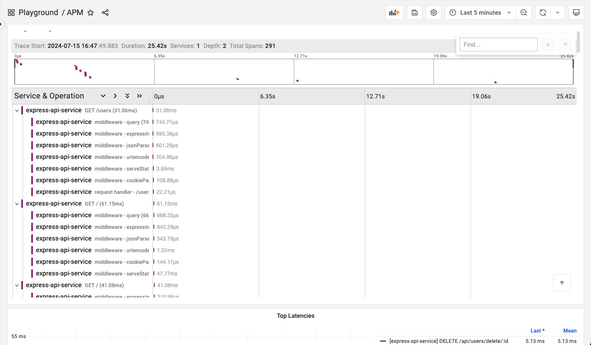

# Auto instrumenting Express application with OpenTelemetry

**OpenTelemetry package versions used in this example:**

- @opentelemetry/api: 1.9.0
- @opentelemetry/auto-instrumentations-node: 0.59.0
- @opentelemetry/exporter-trace-otlp-grpc: 0.201.1
- @opentelemetry/exporter-trace-otlp-http: 0.201.1
- @opentelemetry/instrumentation: 0.201.1
- @opentelemetry/resources: 2.0.1
- @opentelemetry/sdk-node: 0.201.1
- @opentelemetry/sdk-trace-base: 2.0.1
- @opentelemetry/sdk-trace-node: 2.0.1
- @opentelemetry/semantic-conventions: 1.34.0

**To install these exact OpenTelemetry dependencies:**

```bash
npm install \
  @opentelemetry/api@1.9.0 \
  @opentelemetry/auto-instrumentations-node@0.59.0 \
  @opentelemetry/exporter-trace-otlp-grpc@0.201.1 \
  @opentelemetry/exporter-trace-otlp-http@0.201.1 \
  @opentelemetry/instrumentation@0.201.1 \
  @opentelemetry/resources@2.0.1 \
  @opentelemetry/sdk-node@0.201.1 \
  @opentelemetry/sdk-trace-base@2.0.1 \
  @opentelemetry/sdk-trace-node@2.0.1 \
  @opentelemetry/semantic-conventions@1.34.0
```

This example demonstrates how to auto-instrument an Express application with
OpenTelemetry. Make sure you have **Node.js v18** or higher installed on your
machine.

1. To clone this example run the following command:

```bash
npx degit last9/opentelemetry-examples/javascript/express/typescript express
```

2. In the `express/env` directory create `.env` file and add the contents of
   `.env.example` file.

   ```bash
   cd env
   cp .env.example .env
   ```

3. Obtain the OTLP endpoint and the Auth Header from the Last9 dashboard and
   modify the values of the `OTLP_ENDPOINT` and `OTLP_AUTH_HEADER` variables
   accordingly in the `.env` file.

4. Next, install the dependencies by running the following command in the
   `express` directory:

```bash
npm install
```

5. To build the project, run the following command in the `express` directory:

```bash
npm run build
```

6. Start the server by running the following command:

```bash
npm run start
```

Once the server is running, you can access the application at
`http://localhost:8081` by default. Where you can make CRUD operations. The API
endpoints are:

- POST `/api/users/add` - Create a new user
- GET `/api/users/all` - Get all users
- PUT `/api/users/update` - Update a user
- DELETE `/api/users/delete/:id` - Delete a user

7. Sign in to [Last9 Dashboard](https://app.last9.io) and visit the APM
   dashboard to see the traces in action.


