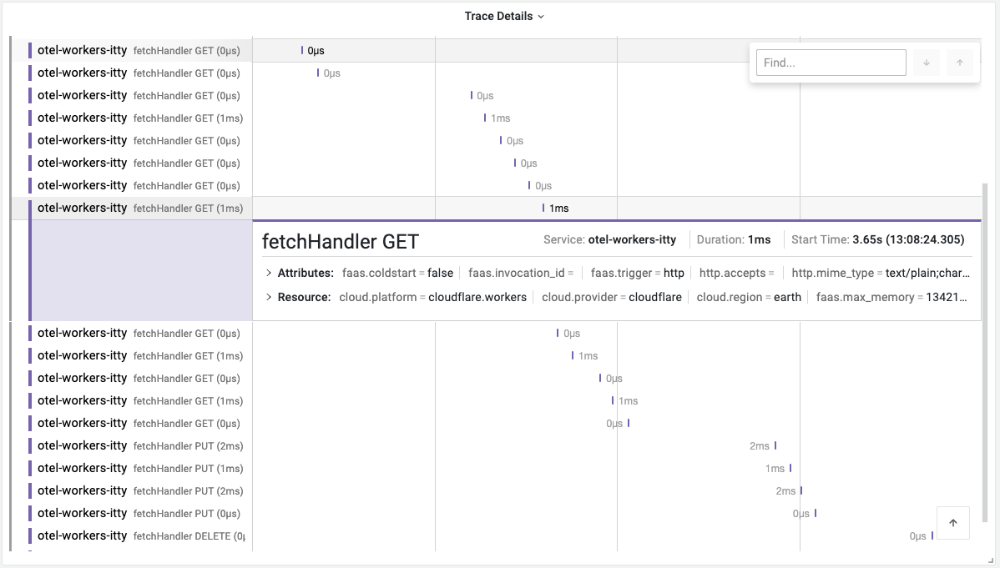

# Instrumenting Cloudflare Worker using OpenTelemetry

This example demonstrates how to instrument a Cloudflare Worker that uses `itty-router` with OpenTelemetry.

1. Install the dependencies:

```bash
npm install
```

2. Obtain the OTLP Auth Header from the [Last9 dashboard](https://app.last9.io).
   The Auth header is required in the next step.

3. Create a new file named `.dev.vars` in the root directory of the project and add the following environment variables:

```bash
OTEL_TRACES_ENDPOINT=https://otlp.last9.io/v1/traces
OTEL_AUTH_HEADER="<BASIC_AUTH_HEADER>"
```

4. Next, run the following command to start the development server:

```bash
npm run dev
```

5. Once the server is running, you can access the application at `http://localhost:8787`.

6. To view the traces, navigate to the [Last9 dashboard](https://app.last9.io) and select the `OpenTelemetry` project.


