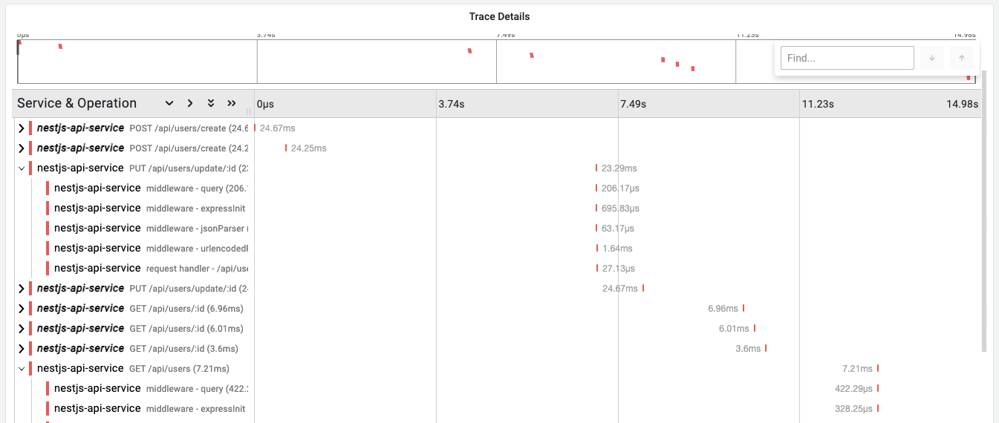

# Auto instrumenting Nest.js application with OpenTelemetry

This example demonstrates how to auto-instrument a Nest.js application with OpenTelemetry. Make sure you have **Node.js v18** or higher installed on your machine.

**OpenTelemetry package versions used in this example:**

- @opentelemetry/api: 1.9.0
- @opentelemetry/auto-instrumentations-node: 0.59.0
- @opentelemetry/exporter-trace-otlp-grpc: 0.201.1
- @opentelemetry/exporter-trace-otlp-http: 0.201.1
- @opentelemetry/instrumentation: 0.201.1
- @opentelemetry/resources: 2.0.1
- @opentelemetry/sdk-node: 0.201.1
- @opentelemetry/sdk-trace-base: 2.0.1
- @opentelemetry/sdk-trace-node: 2.0.1
- @opentelemetry/semantic-conventions: 1.34.0

**To install these exact OpenTelemetry dependencies:**

```bash
npm install \
  @opentelemetry/api@1.9.0 \
  @opentelemetry/auto-instrumentations-node@0.59.0 \
  @opentelemetry/exporter-trace-otlp-grpc@0.201.1 \
  @opentelemetry/exporter-trace-otlp-http@0.201.1 \
  @opentelemetry/instrumentation@0.201.1 \
  @opentelemetry/resources@2.0.1 \
  @opentelemetry/sdk-node@0.201.1 \
  @opentelemetry/sdk-trace-base@2.0.1 \
  @opentelemetry/sdk-trace-node@2.0.1 \
  @opentelemetry/semantic-conventions@1.34.0
```

1. To clone this example run the following command:

```bash
npx degit last9/opentelemetry-examples/javascript/nestjs nestjs
```

2. In the `nestjs` directory create `.env` file and add the contents of `.env.example` file.

   ```bash
   cp .env.example .env
   ```

3. Obtain the OTLP endpoint and the Auth Header from the Last9 dashboard and modify the values of the `OTEL_EXPORTER_OTLP_ENDPOINT` and `OTEL_EXPORTER_OTLP_HEADERS` variables accordingly in the `.env` file.

4. Next, install the dependencies by running the following command in the `nestjs` directory:

```bash
npm install
```

5. Start the server by running the following command:

```bash
npm run start
```

Once the server is running, you can access the application at `http://localhost:3000` by default. Where you can make CRUD operations. The API endpoints are:

- POST `/api/users` - Create a new user
- GET `/api/users` - Get all users
- PUT `/api/users/:id` - Update a user
- DELETE `/api/users/:id` - Delete a user
- GET `/api/users/:id` - Get a user

6. Sign in to [Last9 Dashboard](https://app.last9.io) and visit the APM dashboard to see the traces in action.


