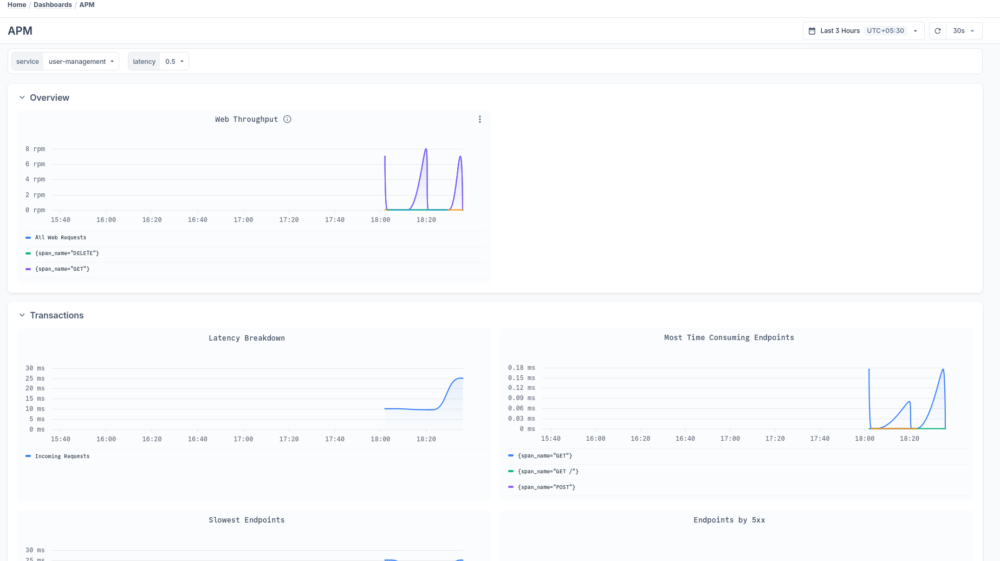

# Auto instrumenting Next.js application with OpenTelemetry

This example demonstrates how to auto-instrument a Next.js application with
OpenTelemetry. Make sure you have **Node.js v18** or higher installed on your
machine.

1. To clone this example run the following command:

```bash
npx degit last9/opentelemetry-examples/javascript/nextjs nextjs
```

2. Now, navigate to the `nextjs` directory and install the dependencies:

```bash
cd nextjs
npm install
```

3. Obtain the Basic Auth credentials from the
   [Last9 dashboard](https://app.last9.io). We will use these credentials in
   next steps.

4. Next create a `.env.local` file by copying the contents of the `.env.example`
   file:

```bash
cp .env.example .env.local
```

5. Update the `OTEL_EXPORTER_OTLP_HEADERS` variable in the `.env.local` file
   with the basic authentication values obtained from the Last9 dashboard.

   ```env
    OTEL_EXPORTER_OTLP_HEADERS="Authorization=Basic <BASIC_AUTH_TOKEN>"
   ```

6. Start the server by running the following command:

```bash
npm run dev
```

Once the server is running, you can access the application at
`http://localhost:3000` by default. The API endpoints are:

- GET `/` - Home page
- GET `/api/users`
- GET `/api/users/:id`
- POST `/api/users`
- PUT `/api/users/:id`
- DELETE `/api/users/:id`

7. Sign in to [Last9 Dashboard](https://app.last9.io) and visit the APM
   dashboard to see the traces in action.


