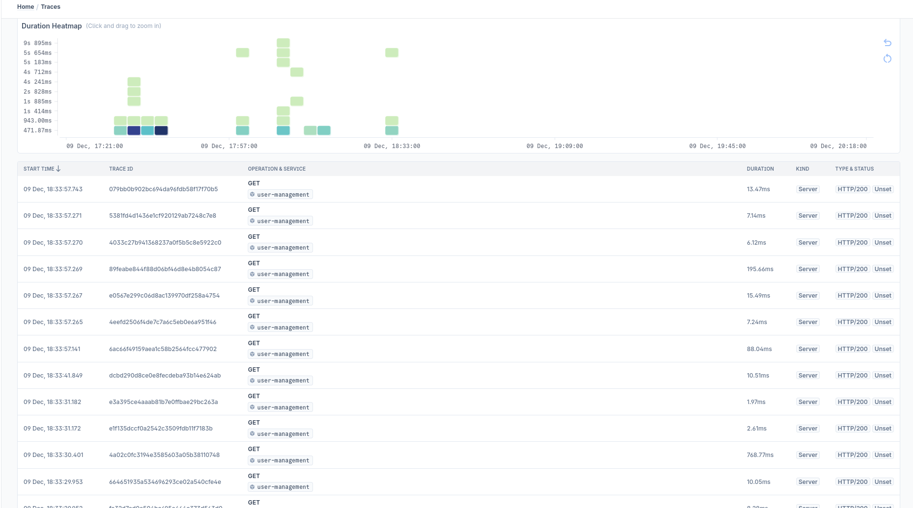

# Auto instrumenting NextJS application with OpenTelemetry

This example demonstrates how to auto-instrument an NextJS application with
OpenTelemetry. Make sure you have **Node.js v18** or higher installed on your
machine.

1. To clone this example run the following command:

```bash
npx degit last9/opentelemetry-examples/javascript/nextjs/user-management nextjs
```

2. In the `express/env` directory create `.env` file and add the contents of
   `.env.example` file.

   ```bash
   cd env
   cp .env.example .env
   ```

3. Obtain the OTLP endpoint and the Auth Header from the Last9 dashboard and
   modify the values of the `OTLP_ENDPOINT` and `OTLP_AUTH_HEADER` variables
   accordingly in the `.env` file.

4. Next, install the dependencies by running the following command in the
   `nextjs` directory:

```bash
npm install
```

5. To build the project, run the following command in the `nextjs` directory:

```bash
npm run build
```

6. Start the server by running the following command:

```bash
npm run start
```

Once the server is running, you can access the application at
`http://localhost:8081` by default. Where you can make CRUD operations. The API
endpoints are:

- GET `/api/users/` - Get all users
- CREATE a new user in the `user-management` page
- DELETE a user in the `user-management` page using delete button

7. Sign in to [Last9 Dashboard](https://app.last9.io) and visit the APM
   dashboard to see the traces in action.


