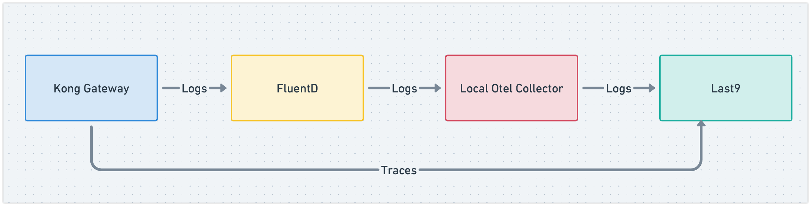

# Instrumenting Kong with OpenTelemetry

## Project Structure

- `docker-compose.yaml`: Docker Compose file for running the services
- `otel-config.yaml`: Configuration file for OpenTelemetry Collector
- `fluent.conf`: Configuration file for FluentD

## Kong Version

This example uses Kong Gateway 3.7.x. It is expected to work with older 3.x versions as well.

## Data flow



## Running the Services

```bash
docker compose up -d
```
This will start the services and run the migrations.

## Sending Logs to OpenTelemetry Collector

The Docker containers are configured to send logs to FluentD as follows:

```yaml
x-logging: &default-logging
  driver: fluentd
  options:
    fluentd-address: localhost:24224
    fluentd-async: "true"
    tag: docker.{{.Name}}
    env: 'ENV'
```

> Notice the additional `env` option. This is used to set the `deployment.environment` resource attribute in the OpenTelemetry Collector. You can also add addiiotnal metadata via the environment variables to the log messages.

To enable logging for Kong Gateway, set the logging driver for Kong container to `default-logging`.

```yaml
kong:
    container_name: kong
    image: kong:latest
    environment:
      KONG_DATABASE: postgres
      KONG_PG_HOST: kong-database
      KONG_PG_USER: kong
      KONG_PG_PASSWORD: ${POSTGRES_PASSWORD:-kongpass}
      KONG_PROXY_ACCESS_LOG: /dev/stdout
      KONG_ADMIN_ACCESS_LOG: /dev/stdout
      KONG_PROXY_ERROR_LOG: /dev/stderr
      KONG_ADMIN_ERROR_LOG: /dev/stderr
      KONG_ADMIN_LISTEN: '0.0.0.0:8001'
      KONG_ADMIN_GUI_URL: 'http://localhost:8002'
      KONG_TRACING_INSTRUMENTATIONS: all
      KONG_TRACING_SAMPLING_RATE: 1.0
      ENV: production
    ports:
      - "8000:8000"
      - "8443:8443"
      - "8001:8001"
      - "8002:8002"
    depends_on:
      - kong-migration
      - fluentd
    logging:
      <<: *default-logging
```

The fluentd container is configured to receive logs from the Kong container and forward them to local OpenTelemetry Collector.

```
<source>
  @type forward
  port 24224
  bind 0.0.0.0
</source>

<match docker.**>
  @type forward
  send_timeout 60s
  recover_wait 10s
  hard_timeout 60s

  <server>
    name otel-collector
    host otel-collector
    port 8006
  </server>
</match>
```

The OpenTelemetry Collector is configured to receive logs from the FluentD container and export them to Last9.

> Additionally, the OpenTelemetry Collector sets the service name to container_name tag and deployment.environment to ENV environment variable.

## Sending Traces to OpenTelemetry Collector

First of all, enable tracing for Kong Gateway by setting the following [configuration options](https://docs.konghq.com/gateway/3.7.x/reference/configuration/#tracing_instrumentations):

```
KONG_TRACING_INSTRUMENTATIONS: all
KONG_TRACING_SAMPLING_RATE: 1.0
```
Send the following curL call to add the OpenTelemetry plugin to the Kong Gateway.

```bash
curl -X POST http://localhost:8001/plugins \
   --header "accept: application/json" \
   --header "Content-Type: application/json" \
   --data '
   {
 "name": "opentelemetry",
 "config": {
   "endpoint": "<last9_otlp_endpoint>/v1/traces",
   "headers": {
     "Authorization": "Basic <last9_api_key>"
   }
 }
}'
```

> Read more about [Kong OpenTelemetry Plugin](https://docs.konghq.com/hub/kong-inc/opentelemetry/3.7.x/how-to/basic-example/).

Now, you should be able to see Kong Gateway traces in Last9. The Service Name will be `kong`.
