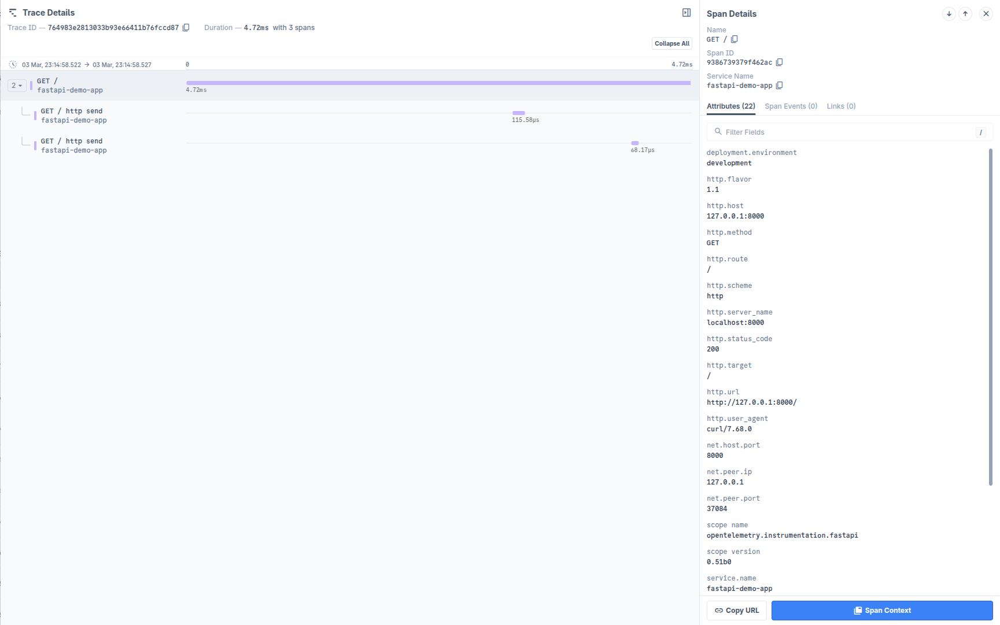

# Auto instrumentating FastAPI application using OpenTelemetry

This example demonstrates how to instrument a simple FastAPI application with
OpenTelemetry.

1. Create a virtual environment and install the dependencies:

```bash
python -m venv .venv
source .venv/bin/activate
pip install -r requirements.txt
```

2. Install the Auto Instrumentation packages using the `opentelemetry-bootstrap`
   tool:

```bash
opentelemetry-bootstrap -a requirements
```
It will output the packages that you can add to `requirements.txt`.

```bash
opentelemetry-api>=1.15.0
opentelemetry-sdk>=1.15.0
opentelemetry-instrumentation-fastapi>=0.36b0
opentelemetry-exporter-otlp>=1.15.0
opentelemetry-instrumentation-requests>=0.36b0
opentelemetry-distro==0.48b0
```

Additionally, install these optional packages for enhanced functionality:

```bash
# AWS SDK extension for better AWS resource detection
pip install opentelemetry-sdk-extension-aws

# Container ID resource detector for containerized environments
pip install opentelemetry-resource-detector-containerid
```

For more details on the container ID resource detector, see: https://github.com/open-telemetry/opentelemetry-python-contrib/tree/main/resource/opentelemetry-resource-detector-containerid

Copy these packages to your `requirements.txt` file and run the command again to install the packages.

```bash
pip install -r requirements.txt
```

3. Obtain the OTLP Auth Header from the [Last9 dashboard](https://app.last9.io).
   The Auth header is required in the next step.

4. Next, run the commands below to set the environment variables.

```bash
export OTEL_SERVICE_NAME=fastapi-app
export OTEL_EXPORTER_OTLP_ENDPOINT=https://otlp.last9.io
export OTEL_EXPORTER_OTLP_HEADERS="Authorization=<BASIC_AUTH_HEADER>"
export OTEL_TRACES_EXPORTER=otlp
export OTEL_EXPORTER_OTLP_PROTOCOL="http/protobuf"
```

> Note: `BASIC_AUTH_HEADER` should be replaced with the URL encoded value of the
> basic authorization header. Read this post to know how
> [Python Otel SDK](https://last9.io/blog/whitespace-in-otlp-headers-and-opentelemetry-python-sdk/)
> handles whitespace in headers for more details.

5. Run the FastAPI application:

**Local Development (Simple Uvicorn):**
```bash
./start.sh
```

**Production (Gunicorn + Auto Instrumentation):**
```bash
OTEL_EXPORTER_OTLP_ENDPOINT=http://localhost:4317 ./start.sh
```

The start script automatically detects the presence of `OTEL_EXPORTER_OTLP_ENDPOINT` environment variable:
- **If set**: Uses gunicorn with uvicorn workers and full OpenTelemetry auto instrumentation
- **If not set**: Uses simple uvicorn for local development

6. Once the server is running, you can access the application at
   `http://127.0.0.1:8000` by default. The API endpoints are:

- GET `/` - Hello World
- GET `/items/:id` - Get items by ID

7. Sign in to [Last9 Dashboard](https://app.last9.io) and visit the APM
   dashboard to see the traces in action.



## How the Conditional Startup Works

The `app.py` file contains a simple FastAPI application with a main function:

```python
if __name__ == "__main__":
    uvicorn.run(app, host="0.0.0.0", port=8000)
```

**Important**: This main function only executes during local development when you run `python app.py` directly. In production:

- Gunicorn imports the `app` object from `app.py` 
- When imported, `__name__ == "app"` (not `"__main__"`)
- The main function block is **never executed**
- Gunicorn manages server startup using uvicorn workers
- OpenTelemetry initialization happens via the `post_fork` hook in `gunicorn.conf.py`

## Running with Circus and Gunicorn for Production

For production deployments with multiple workers and process management, you can use Circus + Gunicorn instead of running Uvicorn directly. This setup properly handles OpenTelemetry auto-instrumentation with forked worker processes.

### Why Circus + Gunicorn?

- **Process Management**: Circus provides robust process monitoring and management
- **Multi-Worker Support**: Gunicorn handles multiple workers better than Uvicorn's `--workers` option
- **OpenTelemetry Compatibility**: Auto-instrumentation works correctly with Gunicorn's worker forking model
- **Production Ready**: Better resource management and fault tolerance

### Setup Steps

1. **Update requirements.txt** to include Gunicorn:
```bash
# Add to your requirements.txt
gunicorn>=20.0.0
circus>=0.18.0
```

2. **Create gunicorn.conf.py** configuration:
```python
import os

# Server socket
bind = "0.0.0.0:8000"
backlog = 2048

# Worker processes
workers = 2
worker_class = "uvicorn.workers.UvicornWorker"
worker_connections = 1000
timeout = 60
keepalive = 2

# Restart workers after this many requests, to prevent memory leaks
max_requests = 5000
max_requests_jitter = 1000

# Logging
loglevel = "info"
errorlog = "-"
accesslog = "-"

# Process naming
proc_name = "fastapi-otel-app"

# Server mechanics
daemon = False
pidfile = "/tmp/gunicorn.pid"
preload_app = False

```

3. **Create circus.ini** configuration:
```ini
[circus]
check_delay = 5
endpoint = tcp://127.0.0.1:5555
pubsub_endpoint = tcp://127.0.0.1:5556
stats_endpoint = tcp://127.0.0.1:5557

[watcher:fastapi-app]
cmd = opentelemetry-instrument gunicorn -c gunicorn.conf.py app:app
numprocesses = 1
copy_env = True

[env:fastapi-app]
OTEL_EXPORTER_OTLP_TRACES_EXPORTER = console
OTEL_SERVICE_NAME = fastapi-gunicorn-app
OTEL_SERVICE_VERSION = 1.0.0
```

4. **Create start.sh** script:
```bash
#!/bin/bash

# Set OpenTelemetry environment variables
export OTEL_SERVICE_NAME="${OTEL_SERVICE_NAME:-fastapi-gunicorn-app}"
export OTEL_SERVICE_VERSION="${OTEL_SERVICE_VERSION:-1.0.0}"
export OTEL_RESOURCE_ATTRIBUTES="service.name=${OTEL_SERVICE_NAME},service.version=${OTEL_SERVICE_VERSION}"
export OTEL_EXPORTER_OTLP_ENDPOINT="${OTEL_EXPORTER_OTLP_ENDPOINT:-http://localhost:4317}"

# Start Circus with the configuration
echo "Starting FastAPI application with Circus (Gunicorn 2 workers) and OpenTelemetry auto-instrumentation..."
circusd circus.ini
```

5. **Simplify your app.py** (remove manual instrumentation):
```python
from fastapi import FastAPI

# Create a FastAPI application
app = FastAPI()

@app.get("/")
async def root():
    return {"message": "Hello World from FastAPI with auto-instrumentation!"}

@app.get("/items/{item_id}")
async def read_item(item_id: int):
    return {"item_id": item_id}
```

6. **Start the application**:
```bash
chmod +x start.sh
./start.sh
```

### Key Differences from Uvicorn

| Aspect | Uvicorn Direct | Circus + Gunicorn |
|--------|----------------|-------------------|
| **Workers** | `uvicorn --workers 2` (problematic with OTEL) | Gunicorn manages 2 workers properly |
| **Process Management** | Basic process handling | Circus provides monitoring, restart, scaling |
| **OpenTelemetry** | Auto-instrumentation breaks with `--workers` | Works correctly with worker forking |
| **Production Ready** | Basic development server | Full production deployment setup |
| **Resource Management** | Limited control | Fine-grained worker lifecycle management |

### Benefits

- ✅ **Full OpenTelemetry auto-instrumentation** works with multiple workers
- ✅ **Process monitoring** and automatic restarts via Circus  
- ✅ **Load balancing** across multiple Gunicorn workers
- ✅ **Production-grade** setup with proper resource management
- ✅ **Easy scaling** by adjusting worker count in configuration
- ✅ **macOS Compatibility** - Automatically sets `NO_PROXY=*` to prevent proxy-related crashes on macOS

### Testing

After starting, you should see traces being generated for each request, with different worker processes handling the load balancing.
