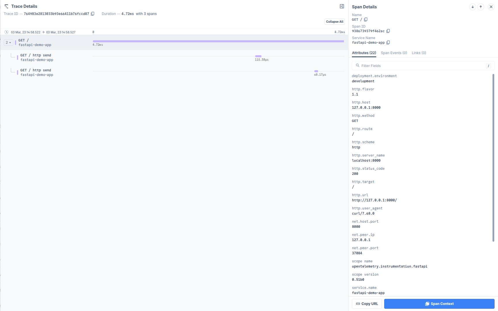

# Auto instrumentating FastAPI application using OpenTelemetry

This example demonstrates how to instrument a simple FastAPI application with
OpenTelemetry.

1. Create a virtual environment and install the dependencies:

```bash
python -m venv .venv
source .venv/bin/activate
pip install -r requirements.txt
```

2. Install the Auto Instrumentation packages using the `opentelemetry-bootstrap`
   tool:

```bash
opentelemetry-bootstrap -a requirements
```
It will output the packages that you can add to `requirements.txt`.

```bash
opentelemetry-api>=1.15.0
opentelemetry-sdk>=1.15.0
opentelemetry-instrumentation-fastapi>=0.36b0
opentelemetry-exporter-otlp>=1.15.0
opentelemetry-instrumentation-requests>=0.36b0
opentelemetry-distro==0.48b0
```

Copy these packages to your `requirements.txt` file and run the command again to install the packages.

```bash
pip install -r requirements.txt
```

3. Obtain the OTLP Auth Header from the [Last9 dashboard](https://app.last9.io).
   The Auth header is required in the next step.

4. Next, run the commands below to set the environment variables.

```bash
export OTEL_SERVICE_NAME=fastapi-app
export OTEL_EXPORTER_OTLP_ENDPOINT=https://otlp.last9.io
export OTEL_EXPORTER_OTLP_HEADERS="Authorization=<BASIC_AUTH_HEADER>"
export OTEL_TRACES_EXPORTER=otlp
export OTEL_EXPORTER_OTLP_PROTOCOL="http/protobuf"
```

> Note: `BASIC_AUTH_HEADER` should be replaced with the URL encoded value of the
> basic authorization header. Read this post to know how
> [Python Otel SDK](https://last9.io/blog/whitespace-in-otlp-headers-and-opentelemetry-python-sdk/)
> handles whitespace in headers for more details.

5. Run the FastAPI application:

```bash
opentelemetry-instrument python app.py
```

6. Once the server is running, you can access the application at
   `http://127.0.0.1:8000` by default. Where you can access the endpoint. The
   API endpoints are:

- GET `/` - Hello World
- GET `/items/:id` - Get items by ID

7. Sign in to [Last9 Dashboard](https://app.last9.io) and visit the APM
   dashboard to see the traces in action.


