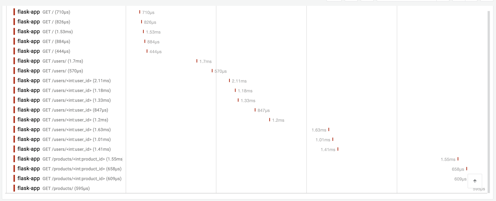

# Auto instrumentating Flask application using OpenTelemetry

This example demonstrates how to instrument a simple Flask application with
OpenTelemetry.

1. Create a virtual environment and install the dependencies:

```bash
python -m venv .venv
source .venv/bin/activate
pip install -r requirements.txt
```

2. Install the Auto Instrumentation packages using the `opentelemetry-bootstrap`
   tool:

```bash
opentelemetry-bootstrap -a requirements
```
It will output the packages that you can add to `requirements.txt`.

```bash
opentelemetry-instrumentation-asyncio==0.48b0
opentelemetry-instrumentation-dbapi==0.48b0
opentelemetry-instrumentation-logging==0.48b0
opentelemetry-instrumentation-sqlite3==0.48b0
opentelemetry-instrumentation-threading==0.48b0
opentelemetry-instrumentation-urllib==0.48b0
opentelemetry-instrumentation-wsgi==0.48b0
opentelemetry-instrumentation-flask==0.48b0
opentelemetry-instrumentation-grpc==0.48b0
opentelemetry-instrumentation-jinja2==0.48b0
opentelemetry-instrumentation-requests==0.48b0
opentelemetry-instrumentation-urllib3==0.48b0
```

Copy these packages to your `requirements.txt` file and run the command again to install the packages.

```bash
pip install -r requirements.txt
```

3. Obtain the OTLP Auth Header from the [Last9 dashboard](https://app.last9.io).
   The Auth header is required in the next step.

4. Next, run the commands below to set the environment variables.

```bash
export OTEL_SERVICE_NAME=flask-app
export OTEL_EXPORTER_OTLP_ENDPOINT=https://otlp.last9.io
export OTEL_EXPORTER_OTLP_HEADERS="Authorization=<BASIC_AUTH_HEADER>"
export OTEL_TRACES_EXPORTER=otlp
export OTEL_METRICS_EXPORTER=otlp
```

> Note: `BASIC_AUTH_HEADER` should be replaced with the URL encoded value of the
> basic authorization header. Read this post to know how
> [Python Otel SDK](https://last9.io/blog/whitespace-in-otlp-headers-and-opentelemetry-python-sdk/)
> handles whitespace in headers for more details.

5. Run the Flask application:

```bash
opentelemetry-instrument flask run
```

Alternatively, you can programmatically instrument the application as shown in
the `run_app.py` file.

```bash
python run_app.py
```

6. Once the server is running, you can access the application at
   `http://127.0.0.1:5000` by default. Where you can make CRUD operations. The
   API endpoints are:

- GET `/users` - Get all users
- GET `/users/:id` - Get a user by ID
- POST `/users` - Create a new user
- PUT `/users/:id` - Update a user
- DELETE `/users/:id` - Delete a user

- GET `/products` - Get all products
- GET `/products/:id` - Get a product by ID
- POST `/products` - Create a new product

6. Sign in to [Last9 Dashboard](https://app.last9.io) and visit the APM
   dashboard to see the traces and metrics in action.


