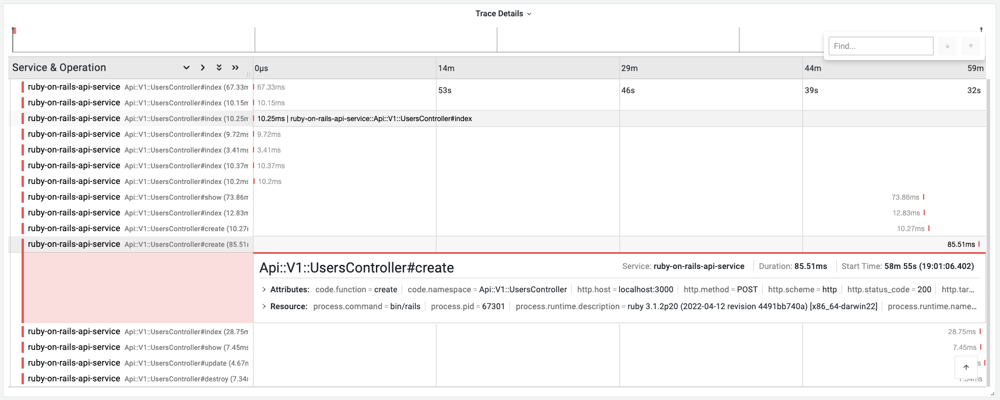

# Auto instrumentating Ruby on rails application using OpenTelemetry

This example demonstrates how to instrument a simple Ruby on rails application
with OpenTelemetry.

1. Install the packages using following command:

```bash
bundle install
```

2. Obtain the OTLP Auth Header from the [Last9 dashboard](https://app.last9.io).
   The Auth header is required in the next step.

3. Next, run the commands below to set the environment variables.

```bash
touch .env
cp .env.example.erb .env
```

4. In the `.env` file, set the value of `OTEL_EXPORTER_OTLP_HEADERS` to the OTLP
   Authorization Header obtained from the Last9 dashboard and make sure the
   value of the header is URL encoded.

```bash
OTEL_EXPORTER_OTLP_HEADERS="Authorization=<BASIC_AUTH_HEADER>"
```

5. Run the Ruby on Rails application:

```bash
bin/rails server
```

6. Once the server is running, you can access the application at
   `http://localhost:3000` by default. The API endpoints are:

- GET `/api/v1/users` - Get all users
- GET `/api/v1/users/:id` - Get a user by ID
- POST `/api/v1/users` - Create a new user
- PUT `/api/v1/users/:id` - Update a user
- DELETE `/api/v1/users/:id` - Delete a user

7. Sign in to [Last9 Dashboard](https://app.last9.io) and visit the APM
   dashboard to see the traces and metrics in action.


