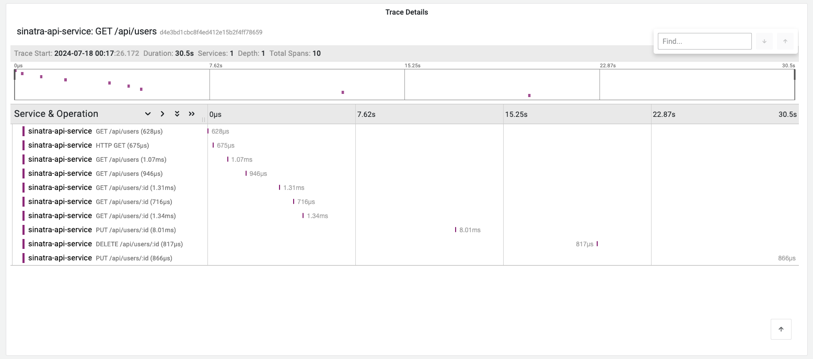

# Auto instrumentating Sinatra application using OpenTelemetry

This example demonstrates how to instrument a simple Sinatra application with
OpenTelemetry. Make sure you have Ruby installed on your machine.

1. Install the packages using following command:

```bash
bundle install
```

2. Obtain the OTLP Auth Header from the [Last9 dashboard](https://app.last9.io).
   The Auth header is required in the next step.

3. Next, Create `.env` file by copying the `.env.example` file and set the
   environment variables.

```bash
cp .env.example .env
```

Replace the `<BASIC_AUTH_HEADER>` with the URL encoded value of the basic
authorization header.

4. Run the Sinatra application:

```bash
ruby app.rb
```

5. Once the server is running, you can access the application at
   `http://127.0.0.1:4567` by default. Where you can make CRUD operations. The
   API endpoints are:

- `GET /api/users` - Returns the list of users.
- `GET /api/users/:id` - Returns the user with the given id.
- `POST /api/users` - Creates a new user.
- `PUT /api/users/:id` - Updates the user with the given id.
- `DELETE /api/users/:id` - Deletes the user with the given id.

6. Sign in to [Last9 Dashboard](https://app.last9.io) and visit the APM
   dashboard to see the traces and metrics in action.


